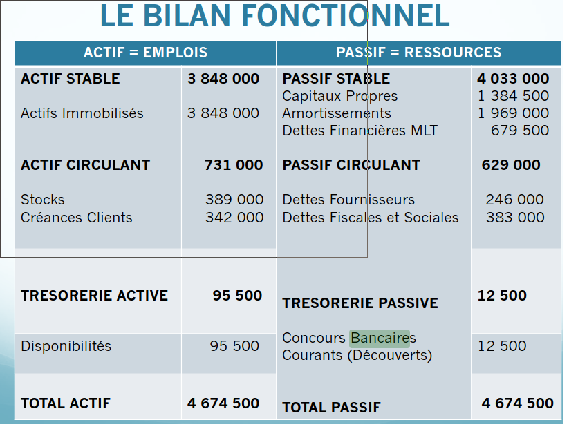
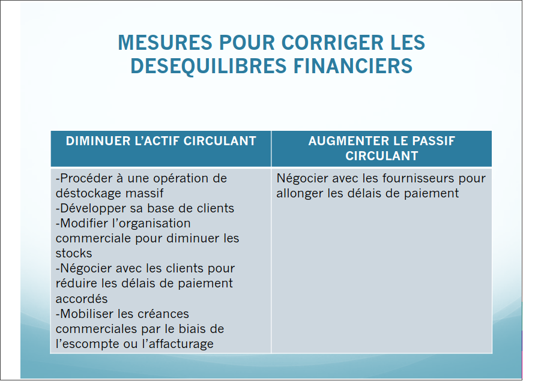
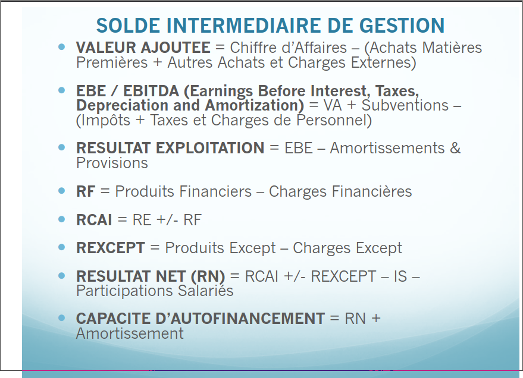

# Dent

## Recap dernier cours

Valeur ajoute : Va
Chiffre d'Affaires : Ca
Consomation Intermediares : Ci
    Achat Matieres premieres + Achat Marchandises + Autres charges

`` Va = Ca - Ci ``

- Va partagee entre differents acteurs
    - Personnel
    - Entreprise
    - Creanciers
    - Actionnaires
- Salaries : Remuneration (+ cotisations sociales)
- Entreprise : profits
- Actionnaires : dividendes (profits)

RSE : Evaluee selon la `triple bottom line : People, Planet, Profit`

## Course

- Intangible assets : establishment costs, research (dev costs), patents..
- Tangible assets: Land, Plant, Machinery, Buildings,,,
- Financial fixed assets: Loans granted guarantees..

- Current assets : 
    - Inventory, Stock : raw material, (consumed for operating cycle)
    - Account receivable: 

- Active cash flow: 
    - Investments securities: Financial assets (gain on resale)
    - Bank account: cash deposited 

- Liabilities :
    - Permanent capital :
        - Share holder equity:
            - companies non borrowed ressources
        - Depreciations and provisions: Saved money to allow renewal of fixed assets
            - frozen money 
        - Long term financial debts: Long term bank loans
    - Current Liabilities
        - accounts payable: payment terms guaranted by suppliers (up to 60 days)
        - fiscal and social dutie: Company does not pay taxes on daily basis but VAT monthly and ... every quarter
    - Passive cash flow:
        - Bank loans: loans due below one year

- Fixed assets financed by stable liabilities (10 years economic life, money available for more than 10 years)

- Financial indicators of balance sheet:
    1. Working Capital requirements : Stable Liabilities - Fixed Assets
    2. Net Working Capital : Current Asset - Current Liabilities
    3. Treasurery : WCR - NWC
        - Also : Active Cash Flow - Passive Cash Flow

    - When these financial balances not met need to change things

    - Shorten Working Capital Cycle :
        - Reducing credit period => reducing average collection period
    - Tackle Financial Imbalances: 
        - Reduce Durable Uses: Sell under use or unused assets, shut down activities
        - Increase long term Financial ressources:
            - Short term :
                - increase capital (existing shareholders or new investors)
                - Favouring self-financing by leaving profits at the disposal of the Company
            - Long term :
                - Decrease current assets: 
                    - Massive destocking operation
                    - Expand customer base
                    - modify commercial organisation to reduce Stock
                    - negotiate with customer to reduce payment term
                    - mobilise trade receivables through discounting or factoring
                - Increate Current Liabilities: 
                    - Negotiate with suppliers to extend payment terms

### Managing the company through the profit and loss

- Operating income and expenses:

25% taxe on profits

RCAI : Resultat Courant Avant Impots

Participation to employees mandatory when at least 50 employees

Exchange rate difference : Negative / Positive
    - Invoice sent with price according to current exchange rate
    - Payment later according to invoice but exchange rate might be different (=> can be win or loss)
    - Generally companies ask banks to "predict" next exchange rates and therefore set the good price

